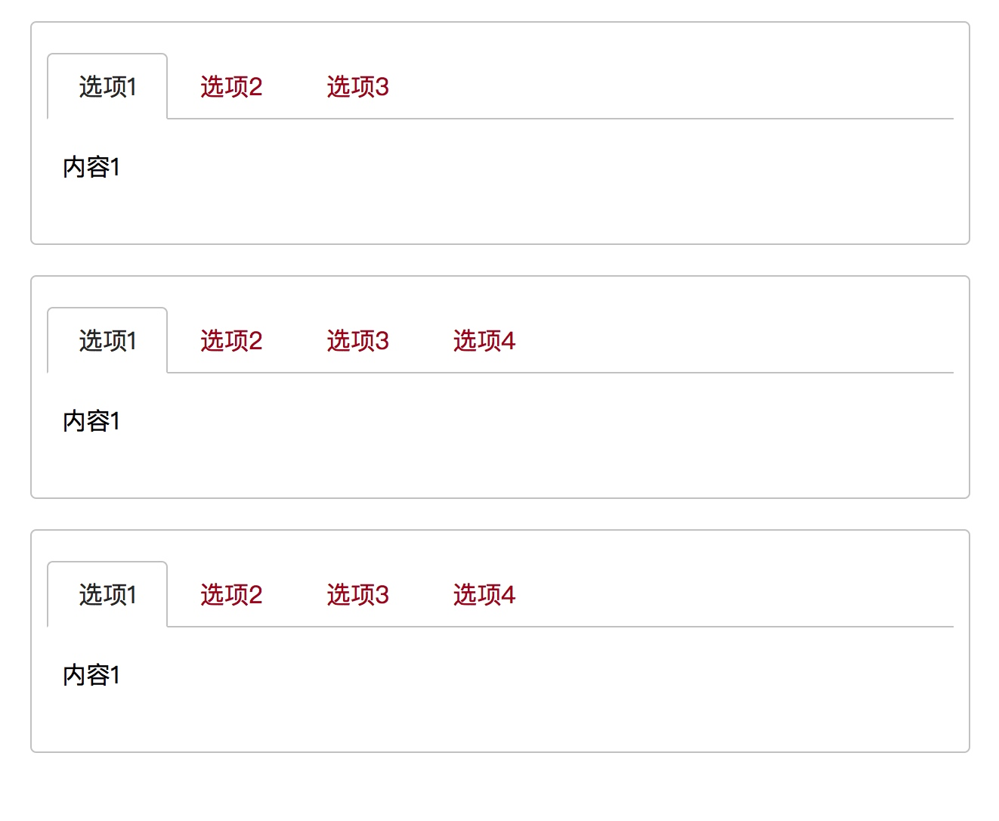

# 常见js/css组件封装

>以下是本人在学习中，对常用的组件及布局的整理。所有代码可以直接在查看源码中看到。

## 布局
### 单栏布局

[预览地址](http://jsbin.com/xamower/edit?html,css,output)

### 两栏布局
>左侧宽度固定，右侧自适应


[预览地址](http://jsbin.com/qolojey/edit?html,css,output)

### 三栏布局

>左右两侧固定，中间自适应


[预览地址](http://jsbin.com/kuxoxin/edit?html,css,output)

### 双飞翼布局

> 双飞翼布局，属于main标签在前面的自适应三栏布局，
        解决了圣杯布局的main宽度必须大于aside的问题。
        


[预览地址](http://jsbin.com/ragiduh/edit?html,css,output)

### 圣杯布局


[预览地址](http://jsbin.com/ziwimuf/edit?html,css,output)

### 瀑布流布局


[预览地址](https://80666881.github.io/common-used-module-layout/%E7%80%91%E5%B8%83%E6%B5%81.html)

## 其他UI效果

### 商品列表

[预览地址](http://jsbin.com/mehahowike/edit?html,output)

### 图片商品列表（可以加载）

[预览地址](http://jsbin.com/lixopo/edit?html,output)


### 渐变轮播

[预览地址](http://jsbin.com/weyove/edit?html,output)


### 图片懒加载

[预览地址](http://jsbin.com/fofoqeqoni/1/edit?html,output)

### tab组件封装


[预览地址](https://80666881.github.io/common-used-module-layout/tab%E7%BB%84%E4%BB%B6.html)

### 拖拽功能

[预览地址]
(http://jsbin.com/garayozika/edit?html,css,js,output)


## css3效果

### loading效果

[预览地址](https://80666881.github.io/common-used-module-layout/%E5%9C%86%E5%BD%A2loading%E6%95%88%E6%9E%9C.html)

---


[预览地址](https://80666881.github.io/common-used-module-layout/loading%E6%95%88%E6%9E%9C1.html)

### 卡片翻转
#### 重要属性
**backface-visibility**

给卡片加入下方代码，表示隐藏被旋转div元素的背面，这样旋转之后，第一张卡片是背面朝屏幕方向，看不到，第二张卡片旋转之后则是正面朝像屏幕，即形成了旋转的效果，主要用到这两个属性啦。

```
backface-visibility:hidden
```

**preserve-3d**
因为需要3d效果，所以在box这个div里要添加如下，表示3d透视
这个加上很关键！

```
transform-style: preserve-3d;
```


[预览地址](https://80666881.github.io/common-used-module-layout/css3%E5%8D%A1%E7%89%87%E7%BF%BB%E8%BD%AC%E6%95%88%E6%9E%9C.html)

### 遮罩层效果


[预览地址](https://80666881.github.io/common-used-module-layout/%E9%81%AE%E7%BD%A9%E6%95%88%E6%9E%9C.html)


